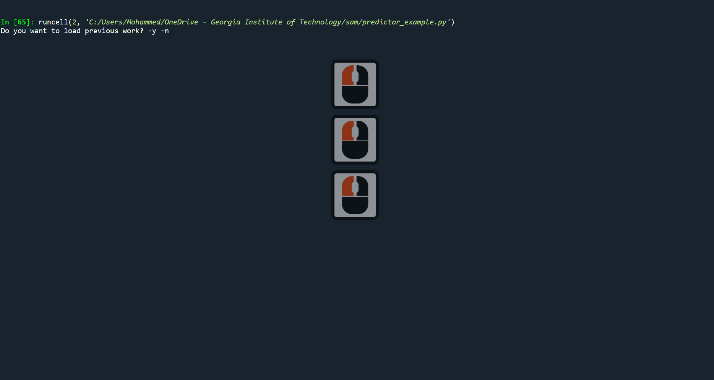

# SAM-for-Seismic-
Original code: Mohammad Alotaibi
SAM-based segmentation tool for Seismic data. We are interested in segmenting the Salt-dome region using SAM. In this code, the user will be able to prompt green points and red points, which represent inclusion and disclusion points of the ROI, respectively. However, this time we are aiming to achieve an mIOU of 0.9 **(on average using the best score, not on each single one)**. This is easily achievable due to the new added features.

# Instructions: 
1. Download SAM weights using :  
`!wget -q https://dl.fbaipublicfiles.com/segment_anything/sam_vit_h_4b8939.pth  `   
**or from this [direct-link](https://dl.fbaipublicfiles.com/segment_anything/sam_vit_h_4b8939.pth)**
and place it in your repository folder.  
2. Figure out which dataset corresponds to your group, and download the appropiate samples and labels from [here](https://www.dropbox.com/scl/fo/zxmucpwwnd4w0428bj9r9/h?rlkey=q0ehe26z0kdyma0ngboa7pdu0&dl=0) and place them in your repository. Rename the files as samples.npy and labels.npy respectively.

3. Run the code your preffered IDE, the code has been tested on Pycharm, Spyder, Jupyter Notebook. The code will load the SAM weights and ask if you have previous work that you want to continue. 
  - If this is your first time, then type n.
  - If this is not your first time and you want to continue from where you stopped, then type y.
4. In both options, you will write your name, and if this is your first time, a new folder by the name you typed will be created (this will be uploaded to canvas a a zip file once you are through all the data). This folder will save metadata in an Excel sheet (also by your name), a txt file where it shows how much time you spend labeling in total, and masks folder where it stores all your segmentations.  
If this is not your first time, then type the same name you typed in your first time, the code will load your next unlabeled sample so you can continue from where you stopped.
5. Below we provide a general description of the prompting tool features and usage. Alternatively, you can also watch this tutorial to familiarize yourself with the tool and start using it.

  - **Tool layout.** Upon running and configuring the tool, a window with three figures will show up (see GIF below). From left to right: Image sample (in this case, a seismic image), ground-truth of the interest region (in this case, a salt dome), and (initially empty) SAM segmented area based on your promoted points along with the IOU. This last figure will be active once you select at least one green point and at least one red point, and will get updated with every new point added.     **please try to achieve the best possible segmentation on each sample**
   

  - **Tool operation.** We have two modes: Green (activated by pressing the letter g on your keyboard), and Red (activated by pressing the letter r on your keyboard). Green corresponds to points **inside** the area of interest, and red corresponds to points **outside** this area. In any of the two modes, you can use the left-click to add a point, or right click to remove one (the most recent one of that mode). Moreover, if you want to remove all your points and start all over again, then you can press the space tab on your keyboard  

  - **Finishing an image.**  Once you feel satisfied with your results you can close the window. But remember, we are interested in getting the best possible segmentation (usually denoted by a high IOU). Most of the time, this is easily achievable. Here is some tips how can you achieve better score: 
&nbsp;   **a.** Try removing rather than adding more points, sometimes adding more points does not help. 
&nbsp;   **b.** If you feel stuck, try removing all points using space tap and start over again   

**NEW: **
**If your score did not improve within 5 consecutive clicks (adding/removing points) the points will be cleared, giving you another chance to start again.
If again, your score did not improve in the 2nd round after any 5 consecutive clicks, then the window will close and best score will be stored.**
   
After closing the window you will be asked if you still want to continue or not. if not you can press n and the code will be terminated. Otherwise, you can press y to proceed to the next sample.  
**IMPORTANT: If you want to close the task and resume later, finish the current sample, and once the question appears you may type 'n', closing the window without trying to achieve the 0.9 score will save your bad score and you will resume with the next one.**   

6. Once you finish all 400 samples ( we expect to take a maximum of 6 hours), zip the generated folder and upload the file on canvas.

